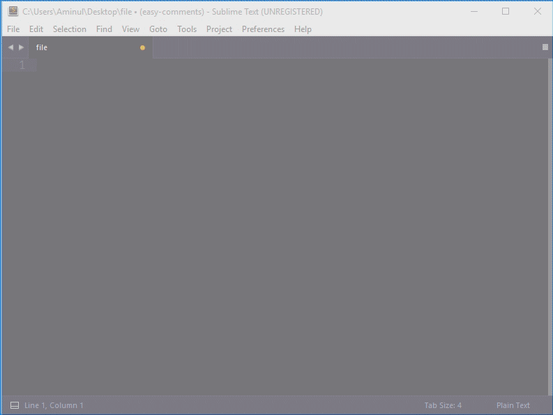
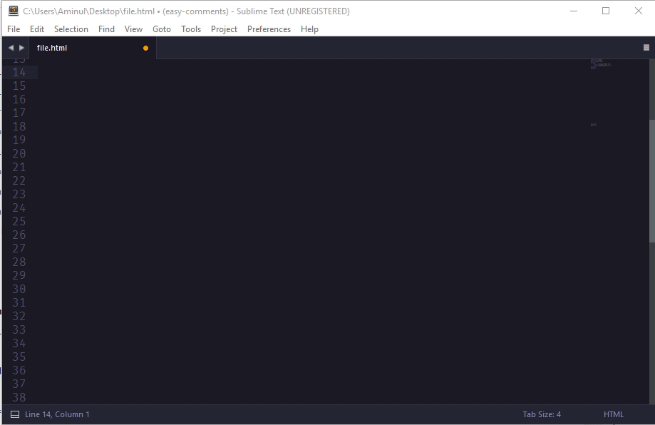

# Easy Comment for Sublime Text 2/3
In this package you will get collection of comment snippets for sublime those snippets can used for HTML, CSS, JS and other markup.

### Comments preview for CSS, JS, PHP etc.



Command: `comm` + `tab`

````
/* Comment */
````

Command: `comms` + `tab`

```
/*============================================*/
/*=           Section comment block          =*/
/*============================================*/

// Your code here

/*======  End of Section comment block  ======*/
```

Command: `commsh` + `tab`
```
/*=====================================*/
/*=           Section header          =*/
/*=====================================*/
```

Command: `commsf` + `tab`
```
/*=========  Section footer  ==========*/
```

Command: `commso` + `tab`

```
/*!----------------------------------------------
  # Section Name
  ---------------------------------------------*/
```

Command: `commb` + `tab`
```
/*!
  *
  * Block comment
  *
  */
```
Command: `commtoc` + `tab`
```
/*!----------------------------------------------
  >>> TABLE OF CONTENTS:
  -----------------------------------------------
	# Section
		## Sub Section
		### Sub Sub Section
	## Sub Section
  # Section
  ---------------------------------------------*/
```
Command: `commtd` + `tab`
```
/*!
  TODO:
  - First todo item
  - Second todo item
  */
```

Command: `commwpt` + `tab` for WordPress theme details
```
/*!
  Theme Name: THEME_NAME
  Theme URI: http://your-theme-uri.tld/
  Author: AUTHOR_NAME
  Author URI: http://author-uri.tld/
  Description: THEME_DESCRIPTION
  Version: 1.0.0
  License: GNU General Public License v2 or later
  License URI: http://www.gnu.org/licenses/gpl-2.0.html
  Text Domain: THEME_DOMAIN
  Tags: THEME_DOMAIN
  */
```

Command: `commwpp` + `tab` for WordPress plugin details
```
/*!
  Plugin Name: PLUGIN_NAME
  Plugin URI: PLUGIN_URI
  Description: PLUGIN_DESCRIPTION
  Author: PLUGIN_AUTHOR
  Version: PLUGIN_VERSION
  Author URI: PLUGIN_VERSION
  License: GNU General Public License v2 or later
  License URI: http://www.gnu.org/licenses/gpl-2.0.html
  Text Domain: PLUGIN_DOMAIN
  */
```

### Comments preview for HTML only.



Command: `commhs` + `tab`
```
<!--==================================-->
<!--=        Section comment         =-->
<!--==================================-->

<!--====  End of Section comment  ====-->
```

Command: `commhsh` + `tab`
```
<!--=================================-->
<!--=        Section header         =-->
<!--=================================-->
```
Command: `commhsf` + `tab`
```
<!--=======  Section footer  =======-->
```

## Source & Credits

This snippets are inspired from @hachesilva's Comment-Snippet repositories.
